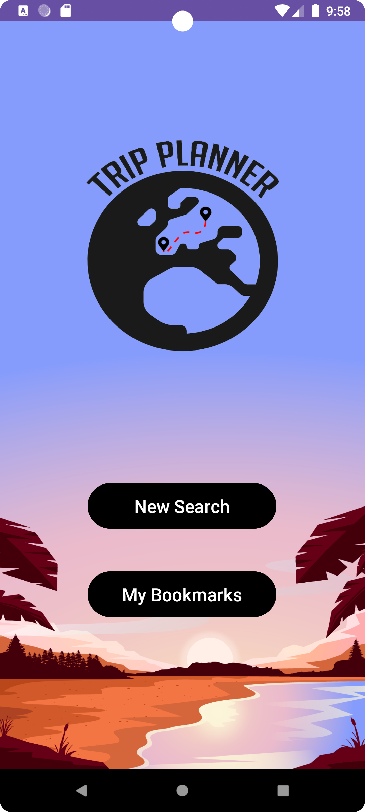
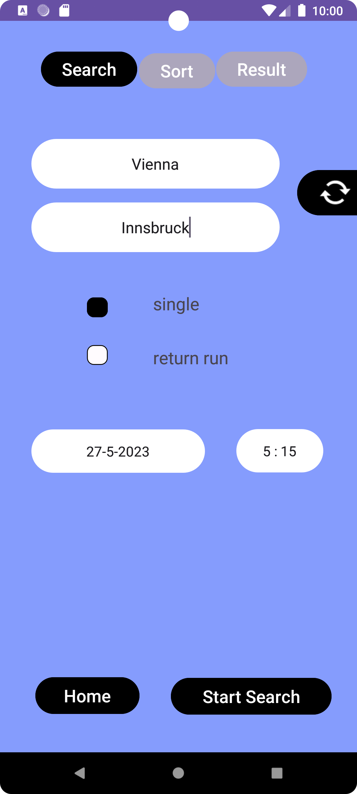
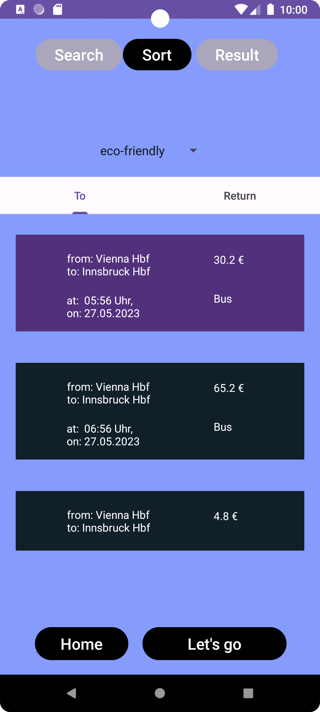
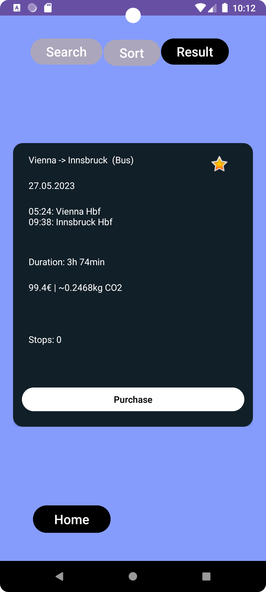
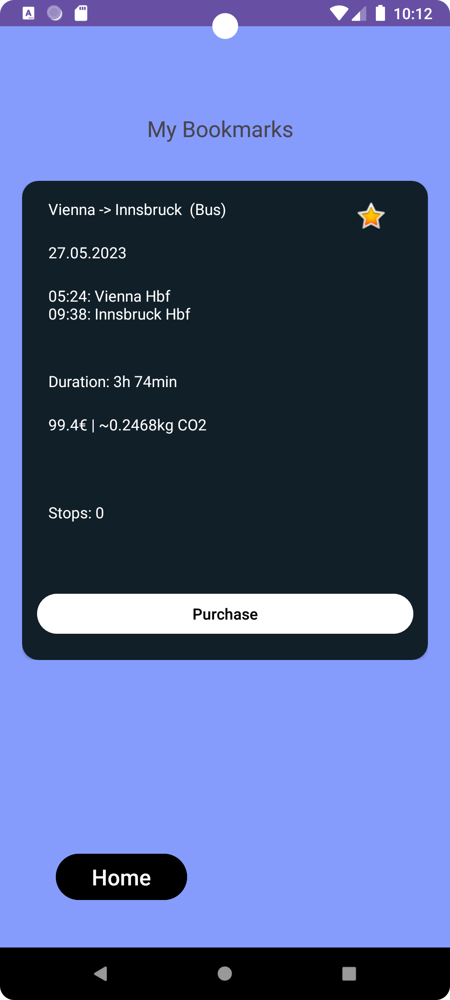
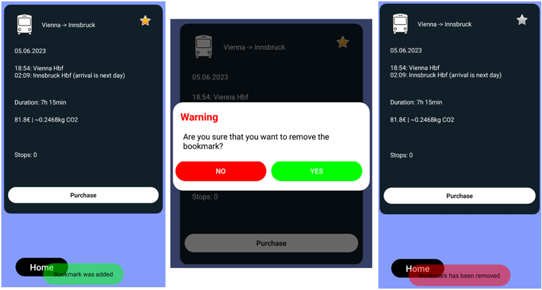

# High-fidelity Prototyp of Trip-Planner App

## about
The Trip Planner app is intended to enable customers to not only transport connections such as bus, train, plane, ship transport and far-reaching to find other options within Europe for an itinerary, but also according to other criteria sort or filter such as eco_friendly, fast, religious able and others.
This was done in M3 based on a requirements analysis (necessary features, primary and secondary personas, scope the app etc.) from M1 and a low-fidelity prototype from M2 High-fidelity prototype created. This high-fidelity prototype M3 was developed in the course of M4 through a questionnaire with inter-View guide evaluated and adapted implementations improved.

 

## project and setup
- a former university project (HCI, human-computer interaction of the University of Vienna, summer semester 2023) to develop an Android app prototype
  
- team members:
  - Martina Ovcharova
  - Felix Windhager
  - Milenko Dukic

- developed in android studio app with Java (so if use this project, launch it there)
- further, more detailed information in the two pdfs:
  - High_fidelity_Prototypen_der_Trip_Planner_App.pdf (german)
  - Evaluierung_High_fidelity_Prototyps_der_Trip_Planner_App.pdf (german)

## android-app layout

- main screen

- navigation (search)

- sort (and filter)

- show chosen trips

- showing bookmarked journeys

- deletion handling and warning

